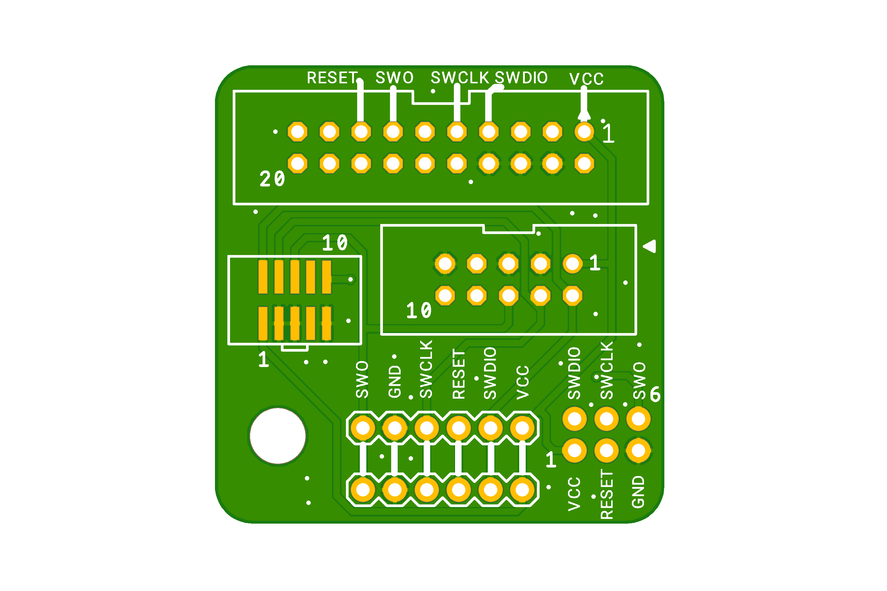
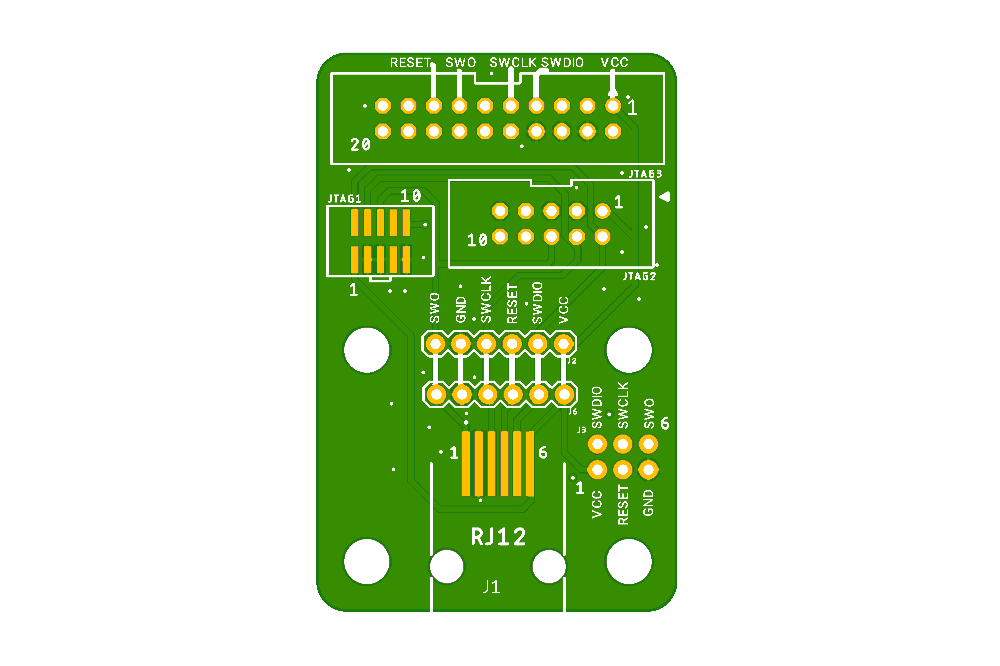

# Universal-SWD-Adapter-Breakout

A simple PCB to adapt between common SWD connector variations.
- 20pin 0.1" Cortex SWD connector (as found on the big J-Link's)
- 10pin 0.1" Cortex SWD connector (as found on ST-Link)
- 10pin 0.05" Cortex SWD connector (as found on J-Link Mini and many targets) 
- Named 0.1" pin header row for all 6 main signals
- 6pin 0.1" TC2030-IDC footprint (compact "SWD-Adapter" only) 

There are two variants, one compact version and an expanded version that add an RJ12 connector intended to be used with the TC2030-MCP-NL Tag Connect cables which are used on Microchip programmers and are often the cheapest and easiest to buy Tag Connect cable from distributors. This variant is also useful for having some solder on pads for hard wiring an SWD connection to a device.

BOM
----

- Molex 95501-6669 (RJ12)
- Samtec FTSH-105-01-L-DV-K-TR (2x5 pin 1.27mm SMT shrouded). Cheaper here on AliExpress: https://s.click.aliexpress.com/e/_DmALpMt
- Molex 90130-1110 (2x5 2.54mm PTH Shrouded)
- Molex 90130-1120 (2x10 2.54mm PTH Shrouded)

Various distributor PNs the RJ12 tag connect cable:

NL version:
- 579-TC2030-MCP-NL 

With hooks:
- 733-53025-851
- 579-TC2030-MCP

For DigiKey:
- TC2030-MCP-NLTC-ND
- TC2030-MCPTC-ND

